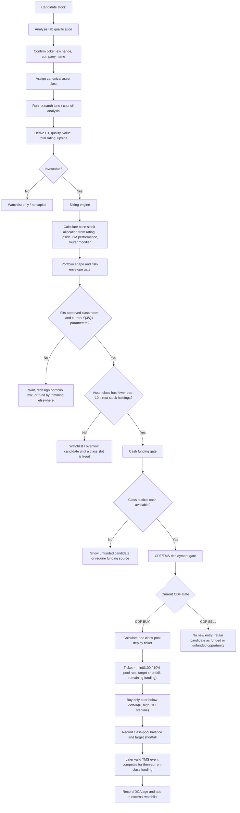
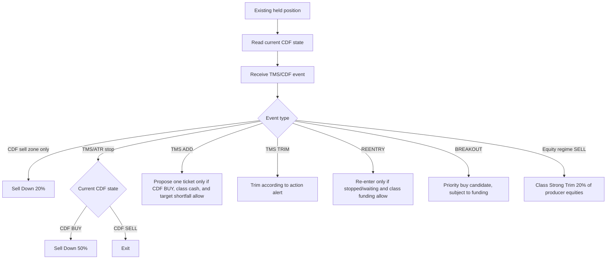
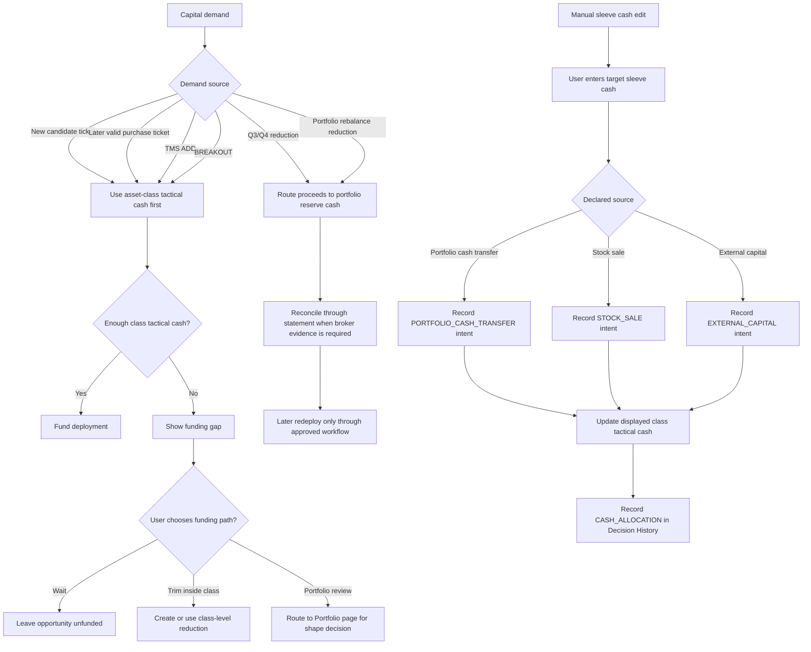

# Decision Flows

Audit date: 14 June 2026.

This document records Alpha Edge decision-flow variants. It contains both live
behaviour and proposed operating models, so every major section is marked with a
status.

Status terms:

- `Live`: implemented behaviour that exists in the application today.
- `Policy`: approved business rule that may not yet be enforced everywhere.
- `Proposed`: target design that must not be treated as live implementation.
- `Reserved`: future variant, not implemented.

## Variant Register

| Variant | Status | Purpose |
| --- | --- | --- |
| System A | Proposed baseline | Direct-stock capital deployment through Analysis, Portfolio, CDF/TMS, and execution gates. Pieces exist today, but the end-to-end guided flow is not yet fully built. |
| System B | Reserved | Same core flow with ETF weighting and ETF contribution integrated directly into allocation. |
| System C | Reserved | Same core flow with breakout weighting, breakout funding, and breakout-versus-index logic. |

System A is the reference flow until System B or C is explicitly approved. Later
variants should extend the same layer boundaries rather than rewriting them.

## Shared Layer Boundaries

Status: `Policy`.

These boundaries are mandatory across all variants.

| Layer | Owns | Must not do |
| --- | --- | --- |
| Analysis tab | Candidate qualification, price targets, quality score, value score, total rating, upside, research lane. | It must not decide execution timing or force portfolio trades. |
| Portfolio tab | Strategic asset-class shape, baseline mix, drift, class-level room. | It must not rewrite CDF/TMS state or silently create detector state. |
| Positions tab | Current holdings, class grouping, signal state, DCA age, portfolio/class exposure. | It must not create new analysis scores. |
| Actions tab | User-facing work queue for required portfolio or position actions. | It must not hide capital requirements inside invisible backend state. |
| Cash layer | Class tactical cash, portfolio reserve cash, recognised cash-equivalent instruments, funding gaps. | It must not silently reserve cash for individual stocks. |
| CDF/TMS layer | Deployment gate, stop severity, add/trim/re-entry timing. | It must not change quality, value, total score, or asset-class target. |
| Execution rule | Price and tranche mechanics. | It must not decide whether the stock is fundamentally investable. |

The operating summary is:

```text
Analysis qualifies the stock.
Portfolio decides whether there is room.
Cash routing decides whether the allocation can actually be funded.
CDF/TMS decides how much and when capital can be deployed or cut.
Execution rules decide price and tranche mechanics.
```

## System A: Direct-Stock Capital Deployment

Status: `Proposed baseline`. This is the desired System A operating model. Some
inputs already exist, including Analysis ratings, CDF/TMS alerts, positions,
portfolio targets, and cash-equivalent recognition. The full cross-page guided
decision flow is not yet live.

System A is the target baseline model. It intentionally does not fold ETF
minimum exposure, core/tactical ETF attribution, or breakout-versus-index logic
into the first-pass capital flow.

### Implementation Snapshot

| Area | Status |
| --- | --- |
| Analysis ratings and price-target inputs | Live |
| Backend sizing endpoint and Target Weight calculation | Live |
| CDF/TMS alert ingestion and visible alert/action surfaces | Partly live |
| Cash-equivalent recognition for `BSUB`, `AAA`, `ASX:AAA`, `ASX_DLY:AAA` | Live classification |
| Manual asset-class tactical cash assignment | Live for user-declared source intent through `asset_class_config.cash_reserve` and `cash_movements`; broader funding-gap routing is proposed |
| End-to-end guided buy-flow sidebar | Proposed |
| Unfunded opportunity workflow | Proposed |
| 10 direct-stock maximum per asset class | Policy, not yet fully enforced |

### Business Rule

A stock cannot become a capital candidate until it has passed the Analysis tab
qualification screen and has a price target, quality score, value score, total
rating, asset class, and suggested allocation. The portfolio layer then decides
whether the asset class has room under the approved portfolio mix, available
cash, and the current portfolio-risk parameters. Q3 and Q4 are continuous
portfolio-risk parameters, not event gates inside this stock-buying flow. A Q3
or Q4 state change has its own Portfolio Risk workflow; System A only checks the
current risk envelope before allowing new deployment. The CDF/TMS layer does not
decide whether the stock is good; it controls deployment eligibility and
position-management timing. CDF BUY permits an otherwise valid class-pool
purchase ticket. CDF SELL blocks a new entry or ordinary add; valid TMS
re-entry remains a separate recovery path. It is not a full-exit command and it
is not a half-allocation rule. Existing positions are
reduced by event severity: CDF sell zone is `Sell Down 20% of current holding`,
ATR/TMS stop in CDF BUY is `Sell Down 50% of current holding`, and ATR/TMS stop
in CDF SELL is the target action `Exit`.

Purchase tickets, target shortfalls, class funding, and the `$100 / 10%` base
ticket are defined by [Pooled Capital Deployment Policy v1.0](POOLED_CAPITAL_DEPLOYMENT_POLICY_V1.md).

Status: `Policy`.

Asset classes should normally hold no more than 10 direct-stock positions. More
than 10 names inside one class is treated as portfolio-design friction rather
than extra diversification. The 11th qualified candidate should remain a
watchlist or overflow candidate unless the user explicitly removes, trims, or
replaces an existing class holding.

### Flow 1: New Candidate Entry And Sizing



#### Commodity-Linked Entry Extension

For a configured producer-equity class, retain the same entry flow above and
apply the commodity policy as a permitted-target ceiling, never as a replacement
for the class-pool ticket:

```text
Core fund / commodity SELL       -> no direct-equity entry, add, breakout, or re-entry
Core fund / commodity BUY        -> normal CDF/VWMA/TMS ticket process
Outperform                        -> may alter a separately approved permitted target;
                                     it never creates or enlarges a ticket by itself
```

The initial entry remains subject to the existing configured VWMA condition.
`OUTPERFORM` opens the final concentration increment; it never creates its own
buy order.

### Flow 2: Active Position Management

Status: `Partly live`. Position alerts already guide ADD, TRIM, Sell Down 20%,
Sell Down 50%, Exit, re-entry, and breakout-style actions. The exact sizing and cash
funding treatment still needs stronger integration.

This is not the same flow as new candidate sizing. It starts only after a stock
is already held or has an open position-management alert. TMS supplies the
position-management event and owns stop/re-entry lifecycle; current CDF state
is its trend context, not a separate post-stop workflow.



#### Sequential Action Rule

Every valid action signal remains an independent, timestamped instruction for
the user. Alpha Edge does not calculate a hidden combined sell target.

1. Show signals in closed-bar order.
2. An earlier full `SELL` is actioned before later percentage reductions.
3. Keep later signals visible as evidence; do not silently merge, cancel, or
   replace them.
4. After the user records execution and broker evidence updates the holding,
   refresh later suggested amounts against that remaining holding.
5. If no holding remains, mark a later percentage instruction
   `NOT_APPLICABLE`; this is a mechanical result, not a portfolio decision.

### Flow 3: Cash Routing And Funding

Status: `Live for manual sleeve-cash intent capture`. Manual class cash is
stored on `asset_class_config.cash_reserve`, and each manual edit records a
`cash_movements` intent row with the declared source. The broader funding-gap
workflow, automatic deployment routing, and unfunded-opportunity handling are
still proposed.

This flow answers whether a qualified deployment can actually be funded. It is
shared by new entries, TMS ADD alerts, breakouts, and re-entry candidates.



### Cash Concepts

| Cash concept | Status | Scope | Used for | Should not do |
| --- | --- | --- | --- | --- |
| Asset-class tactical cash | Live for manual intent capture | One asset class | Manual class cash is stored on `asset_class_config.cash_reserve`; edits write `cash_movements`; target use is eligible deploy tickets for entries, adds, re-entries, and breakouts inside the class. | It must not become permanent stock-level reserved cash or silently assume every increase came from portfolio cash. |
| Recognised cash-equivalent instruments | Live classification | Instrument-level holding records | `BSUB`, `AAA`, `ASX:AAA`, and `ASX_DLY:AAA` are treated as cash/staging rather than ordinary equity exposure. | They must not be described as a separate cash source from class cash. They are instruments used to hold/stage cash. |
| Portfolio reserve cash | Partly live | Whole portfolio | Q3/Q4 reductions, portfolio rebalance reductions, statement-wait workflows. | It must not be confused with class tactical cash. |
| Unfunded opportunity | Proposed workflow | Explicit gap | Shows that a qualified candidate, ADD, or breakout exists without available cash. | It must not silently pull funds from another class. |

Cash-equivalent ticker handling must normalise `AAA`, `ASX:AAA`, and
`ASX_DLY:AAA` to the same key. This is classification logic, not a separate
business flow.

### Entry Versus Active Management

System A deliberately separates two related but different questions.

| Question | Flow | CDF role | TMS role |
| --- | --- | --- | --- |
| Should new capital be assigned to this candidate? | New candidate entry and sizing | BUY permits an eligible ticket; SELL blocks a new entry. | A later valid ADD competes for then-current class funding; it does not unlock reserved capital. |
| What should happen to an existing position? | Active position management | Provides BUY/SELL trend context for TMS stop handling and re-entry eligibility. | Supplies add, trim, stop, and re-entry events. |
| Can the proposed action be funded? | Cash routing and funding | Does not set CDF state; it only checks whether deployable demand can be funded. | TMS ADD/BREAKOUT may create demand, but cash flow decides whether it is funded or unfunded. |

This prevents the stock-buying flow from looking as if every candidate must pass
through a live stop-loss/action branch. It also prevents active position
management from re-running the full Analysis qualification path every time a TMS
event arrives.

### Screen Responsibilities

| Screen | System A responsibility |
| --- | --- |
| Analysis | Holds the candidate qualification screen and produces investable inputs: PT, quality, value, total rating, upside, asset class, and suggested allocation. |
| Portfolio | Shows approved class mix, current class weights, target room, drift, and whether capital can be assigned to the class. |
| Positions | Shows current holdings, CDF/TMS state, DCA state, class share, portfolio share, and selected stock context. |
| Actions | Shows required work only: Q3/Q4 reductions, position actions, statement waits, and completion. |
| Alert Stack | Shows alert origin and urgency; it should not become the full decision engine. |

### UI Flow Surface

Status: `Proposed`.

The decision flow crosses multiple pages, so it should not live only inside the
Analysis tab or only inside Actions.

Recommended UI pattern:

1. Use the right sidebar as a contextual decision-flow surface when the ETF
   Monitor is not the active task.
2. Show the current step, next required step, and blocking reason.
3. Link directly to the relevant page: Analysis for qualification, Portfolio for
   class room, Positions for CDF/TMS state, Actions for required work.
4. Keep active position management in the Alert Stack and Actions surfaces,
   because ADD, TRIM, Sell Down 20%, Sell Down 50%, Exit, and Breakout already enter
   the user through alert/action workflows.

This keeps the flow visible across pages without turning the app into a rigid
wizard.

### Portfolio Risk State Changes Are Separate Flows

System A can read the current Q3 and Q4 values, but it does not create those
values and it does not process detector changes.

Rules:

1. Q3 is always a current percentage parameter. The actionable event is a change
   from the last applied Q3 value, not the mere fact that "Q3 is active".
2. Q3 risk-off state changes create their own Portfolio Risk reduction workflow.
   That workflow is where Q1-sensitive exposure is throttled.
3. Q3 risk-on state changes create their own lightweight Portfolio Risk workflow
   showing that higher Q1 allocation is allowed. They do not force new buys.
4. Q4 is also represented as a current parameter. The Q4D `SELL` state maps to a
   10% market-exposure target; Q4D `BUY` maps to 100%.
5. Q4 state changes create or clear their own crisis workflow. They are not
   evaluated inside the candidate-stock assignment screen.
6. During a stock-buying flow, the system only checks whether the proposed
   deployment fits the current risk envelope.

### Acceptance Outcomes

System A should only be considered live end-to-end when the following user
stories pass:

1. A candidate without Analysis tab qualification cannot receive a suggested
   capital deployment.
2. A qualified candidate receives a base allocation from the sizing engine.
3. An asset class with 10 direct-stock holdings shows the next qualified
   candidate as watchlist/overflow unless the user frees a class slot.
4. A qualified candidate in CDF BUY receives a visible dollar ticket only when
   class funding, remaining class capacity, and its target shortfall allow it.
5. A qualified candidate in CDF SELL receives no new entry or ADD ticket.
6. The suggested ticket is the lesser of the `$100 / 10%` base ticket, target
   shortfall, class funding, and any approved liquidity limit.
7. No second tranche is reserved for a stock. Class tactical cash remains pooled
   until a later valid candidate or event competes for it; cash-equivalent
   instruments such as `BSUB` or `ASX:AAA` may be used to hold that cash.
8. A qualified buy with no class cash is shown as an unfunded opportunity rather
   than being silently ignored.
9. Q3/Q4 reductions route proceeds to portfolio reserve cash, not class tactical
   cash.
10. The stock-buying flow reads the current Q3/Q4 risk envelope without creating
   a Q3/Q4 action.
11. CDF sell zone creates `Sell Down 20%`.
12. ATR/TMS stop with embedded CDF BUY creates `Sell Down 50%`.
13. ATR/TMS stop with embedded CDF SELL creates `Exit`.
14. A commodity equity-regime SELL creates one separate class-level Strong Trim
    of producer-equity holdings; it does not touch the direct commodity sleeve.

## System B: ETF-Integrated Allocation

System B integrates ETF exposure directly into the capital flow instead of
treating the ETF Monitor as a separate competing subsystem.

```text
approved class budget
  -> selected Core ETF and suggested base ratio
  -> bounded momentum adjustment
  -> effective ETF target
  -> remaining direct-stock budget
```

The historical 25% whole-book ETF value is a suggestion, not a minimum. ETF
momentum changes ETF-versus-stock implementation inside a class and must not
change the class's approved total budget.

The open design questions are:

1. How should the application enforce or represent a minimum ETF instrument
   exposure without pretending it can stop the user buying stocks externally?
2. Which ETFs are core class exposure and which are tactical momentum exposure?
3. Can an ETF map to more than one asset class, and if so how is attribution
   displayed?
4. What happens when a class has no suitable ETF?
5. How does ETF CDF/TMS gating interact with stock CDF/TMS gating?

System B must not be implemented by hardcoded ETF-to-class maps in UI code.
Assignments must come from canonical asset-class data plus explicit ETF metadata.

## System C: Breakout-Weighted Allocation

System C is reserved for breakout-specific allocation logic.

The open design questions are:

1. Does BREAKOUT change only deployment priority, or does it change target
   weighting?
2. Should a breakout be measured against the stock's own base case, its asset
   class, or an external index?
3. When does a single breakout justify cross-class funding?
4. When do clustered breakouts justify expanding an asset class?
5. What is the expiry rule when breakout strength fades?

System C must not modify base quality/value scores just because a breakout
signal exists. Any breakout premium must be explicit and separately auditable.
