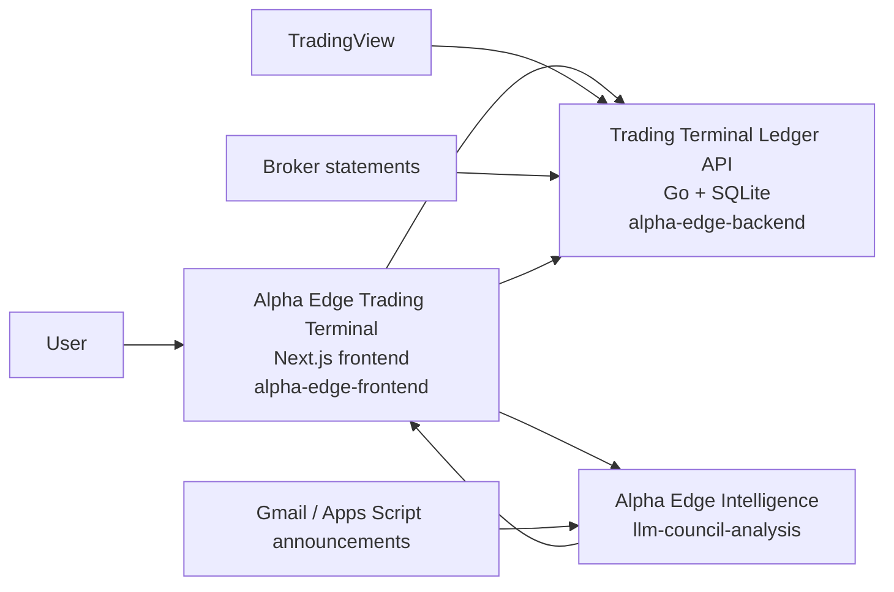
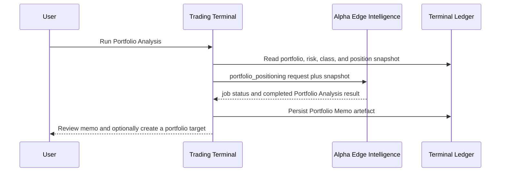

# Alpha Edge Product Architecture

Status: canonical product and service-boundary contract.
Audit date: 19 August 2026.
Product naming clarified: 20 September 2026.

## Purpose

Alpha Edge is one investment operating system. It is not a collection of
unrelated tabs, dashboards, prompts, and AI utilities.

The product has two operational domains:

1. **Alpha Edge Trading Terminal** is the user-facing ledger and decision
   surface. It is where the user sees portfolio state, records decisions, and
   reconciles executed work with broker statements.
2. **Alpha Edge Intelligence** is the separate analysis application. It
   runs the **Analyst Council**, the **Announcement Router**, and the
   **Portfolio Analysis** workflow.

This distinction is logical as well as technical: the Terminal owns durable
portfolio truth and user workflow; Intelligence produces versioned evidence and
analysis. Intelligence does not become a second portfolio ledger or broker
action system.

## Canonical Names

| Canonical name | What it is | Implementation aliases not for user-facing copy |
| --- | --- | --- |
| **Alpha Edge** | The complete product and investment operating system. | The app, the terminal, the council. |
| **Trading Terminal** | The opening user interface and primary operating surface. It contains Positions, Analysis, Portfolio, Markets, Alerts, News, History, and System/Help views. | Frontend app, main app. |
| **Alpha Edge Intelligence** | The separate application containing Announcement Router, Analyst Council and Portfolio Analysis. | Intelligence Service, other server, LLM server. |
| **Analyst Council** | The per-security research capability of Alpha Edge Intelligence. It produces research packets, scores, price targets, and run artefacts. | LLM Council, Council service. |
| **Announcement Router** | The announcement-driven scenario/thesis assessment capability of Alpha Edge Intelligence. It evaluates a new announcement against prior research and emits an auditable result or score. | Scenario router. |
| **Portfolio Analysis** | The top-down portfolio-positioning workflow run by Intelligence. Its durable output is a **Portfolio Memo**. | Portfolio positioning job, AI memo. |
| **Portfolio Memo** | The saved output artefact from Portfolio Analysis. It is evidence and a strategic prior, not an approved portfolio shape or trade instruction. | AI output, memo result. |

Code and transport identifiers may continue to use `llm-council-analysis`,
`portfolio_positioning`, `portfolio_memo_runs`, and
`announcement-router`. They are implementation names, not the product
language.

Alpha Edge is the umbrella product name. Trading Terminal is its operating
workspace; the three intelligence workflows belong to Alpha Edge Intelligence.
Do not label Analyst Council itself as the entire intelligence application, or
present its three workflows as three separately deployed servers. Older references
to "Intelligence Service" describe this same application, not a fourth capability.

## Deployment Topology

The current production topology has three deployable applications, arranged as
two product domains:



The Trading Terminal frontend and ledger API are separate Fly deployments for
operational reasons, but they are one user-facing system. Alpha Edge Intelligence
is the separate second operational system.

| Domain | Current deployment | Owns | Must not own |
| --- | --- | --- | --- |
| Trading Terminal UI | `alpha-edge-frontend` / `alpha-edge-uat-frontend` | navigation, presentation, local draft state, user confirmation controls, calls to both service domains | durable portfolio truth, hidden sizing rules, direct broker execution |
| Trading Terminal Ledger API | `alpha-edge-backend` / `alpha-edge-uat-backend` | SQLite portfolio ledger, watchlist identity, holdings, actions, alert state, statements, portfolio state, market evidence, memo persistence | LLM research execution, unsupervised broker action |
| Alpha Edge Intelligence | `llm-council-analysis` | Council jobs, announcement evaluation, Portfolio Analysis jobs, run artefacts and upstream AI orchestration | Terminal database ownership, statement reconciliation, final user decisions, broker action |

The Alpha Edge Intelligence source code and the Gmail/Apps Script connector are
outside this repository. This repository owns their Terminal-facing integration
contract and must mirror stable external contracts in `DOCS/`.

## Capability Boundaries

### Trading Terminal

The Trading Terminal is the system of record for user-facing investment work.
Every workspace is a view of the same ledger, not a separate decision system.

| Workspace | Primary question it answers | Canonical state it shows |
| --- | --- | --- |
| Positions | What do I hold, and what must I do next? | holdings, primary action queue, statement reconciliation |
| Analysis | What is known about this security, and is research complete? | research inputs, Council results, valuation, target-weight evidence, watchlist identity |
| Portfolio | What is the approved shape, actual allocation, and drift? | approved baseline, current mix, target/rebalance workflow, Portfolio Memo context |
| Markets | Which configured commodity and producer-equity gates are currently open? | append-only commodity evidence and configured source state |
| Alerts | Which TradingView connections exist, and what is their initial/current state? | connection ledger and registered alert configurations |
| News | Which durable portfolio theses have evidence supporting or challenging them? | persisted narrative ledger, memo-seeded foundation, daily evidence |
| History | What happened and what was decided? | historical decisions, events, and performance evidence |
| System / Help | How do current layers relate and how should the user interpret them? | read-only decision architecture and guidance |

### Analyst Council

The Analyst Council is a per-security research workflow. The Terminal sends a
research request through its Council proxy; Intelligence returns a job and a
report packet. The Terminal records the returned analysis fields and links the
stored Council run back to the security.

It is not an action engine. A completed Council run can improve the quality of
research evidence but cannot create a broker trade, alter a statement, or mark
an action complete.

### Announcement Router

The Announcement Router evaluates incoming company announcements against a
previous research/scenario baseline. Its output is an auditable piece of
research evidence, including its source announcement, related run/baseline, and
resulting scenario or conviction change.

The current Terminal integration reads Router signals through the Council proxy
and may use a bounded router score in Analysis sizing. A router result must
never silently change holdings, rename a security, alter the approved portfolio
shape, or execute an action. Any material consequence must enter the Terminal's
ordinary alert/action workflow.

### Portfolio Analysis And The Portfolio Memo

Portfolio Analysis is a distinct, top-down Intelligence workflow, not a third
server and not a generic Council run displayed as a security analysis.

The Terminal prepares a snapshot of the actual portfolio, approved asset-class
vocabulary, current mix, Q3/Q4 state, asset-class context, and positions. The
Alpha Edge Intelligence application returns a structured portfolio-positioning result. The
Terminal persists its Portfolio Memo in `portfolio_memo_runs` and exposes it to
Portfolio and News.



The memo can seed a narrative foundation run or a draft portfolio-rebalance
plan. It cannot automatically approve a portfolio baseline, alter Q3/Q4,
replace security research, or send an order.

The Portfolio workspace exposes this lifecycle as a read-only **Portfolio
Timeline**. The timeline joins Portfolio Analysis memos, target plans, approved
shape snapshots, and broker-derived actual snapshots without collapsing their
different authority levels. A completed Portfolio Analysis is recorded and
shown for review; it does not create a target draft automatically. Alpha Edge
owns the historical memo reader, including the executive summary, analyst
assessment, and chairman conclusion, even though Intelligence produces the
analysis. The user may explicitly create a target from any memo that contains
structured asset-class targets, after which the ordinary target, approval,
action, and statement workflow remains authoritative.

### Timeline Archive Integration

The Timeline also reads existing Intelligence artifacts through the authenticated
Next `GET /api/council/portfolio-memos` proxy. This uses
`/api/portfolio-positioning-runs` and its artifact detail route, not expiring
analysis-job result URLs. Up to 50 saved artifacts are read, four at a time;
individual failures are reported without discarding available Terminal history.
The response exposes memo text and final structured targets, not raw allocator
lanes, source snapshots, or server credentials. Reads do not import or approve.

Terminal memo rows and external artifacts are deduplicated by stable run ID.
When the user creates a target draft, its selected artifact is first saved to
`portfolio_memo_runs` under `intelligence:<run filename>` (or its existing job
identity), and that memo ID travels with the draft. Shape provenance follows
`portfolio_mix_snapshots.source_rebalance_plan_id` to the plan's `memo_job_id`,
independently of pagination. Manual snapshots do not acquire inferred links.

Local/UAT memo-based examples are client-only projections of the real proposed
weights, explicitly labelled hypothetical. They are not database seeds and do
not manufacture a year's worth of memo-backed approvals where no evidence exists.

## Cross-Service Contracts

Every cross-service interaction must have a visible owner, a durable identifier,
and a clear persistence destination.

| Flow | Initiator | Durable identifier | Terminal persistence | Authority |
| --- | --- | --- | --- | --- |
| Security Council run | Terminal Analysis | Council job ID plus run ID plus security identity | `stock_analysis` plus linked run metadata | research evidence |
| Announcement evaluation | Gmail/Apps Script into Intelligence | Gmail message ID plus Router baseline/run ID | Router signal/read model when surfaced to Terminal | scenario/thesis evidence |
| Portfolio Analysis | Terminal Portfolio | memo job ID plus Council run ID | `portfolio_memo_runs` | strategic prior and draft-target input |
| TradingView signal | TradingView into Terminal | alert event ID/source symbol/bar close | `alerts`, position/action state, market evidence | market evidence and alert projection |
| Broker statement | User import into Terminal | statement ID/import timestamp | statement and holdings tables | actual execution and portfolio truth |

Rules:

1. The Terminal database is the only durable source for portfolio holdings,
   actions, approvals, statements, and user acknowledgements.
2. Intelligence results are immutable source artefacts. The Terminal stores the
   portion needed for user workflow and retains source identifiers for audit.
3. Every action shown to the user must be traceable to persisted evidence.
   Intelligence can recommend or score; it cannot mark a financial action done.
4. No service should infer a security identity from display name alone. Stable
   watchlist identity and corporate-action review stay in the Terminal ledger.
5. Retry and duplicate behaviour must be idempotent at the receiving system:
   message ID for announcements, event ID for webhooks, job/run ID for Council
   and Portfolio Analysis.

## One Decision Lifecycle

The user should be able to follow the same lifecycle across every workspace:

```text
Portfolio shape and risk context
  -> market and security evidence
  -> Analyst Council / Announcement Router / Portfolio Analysis evidence
  -> visible Alert or Action when a response is required
  -> user decision and broker execution
  -> broker statement reconciliation
  -> durable history, performance, and narrative update
```

This is the unifying principle for future UI work. A tab may specialise in one
step, but it must never pretend to own the whole lifecycle or silently replace
another layer's authority.

## Cohesion Rules For Future Work

1. **One product name:** use **Alpha Edge** for the product. Use **Trading
   Terminal**, **Analyst Council**, **Announcement Router**, and **Portfolio
   Analysis** only for their specific capability or surface.
2. **One state owner:** a status displayed in more than one workspace must come
   from the same Terminal API read model, not copied frontend calculations.
3. **One action path:** all material recommendations converge on the existing
   Terminal Alerts/Actions workflow and its execution/reconciliation states.
4. **One evidence hierarchy:** market gates, research, announcement assessment,
   and the Portfolio Memo inform a decision; none is a disguised broker command.
5. **One visual contract:** shared state needs shared language, severity, and
   interaction patterns. A visual treatment may differ by density, but its
   meaning cannot change between tabs.
6. **No unnamed integration:** every external source must state its owner,
   input, output, failure behaviour, and place in the decision lifecycle before
   it receives a new UI surface.

## Implementation Backlog

This document establishes naming and boundaries. It does not claim the system
is fully unified yet. The next implementation work should be planned in this
order:

1. Publish a versioned Intelligence Service contract that covers Council jobs,
   Announcement Router messages/results, and Portfolio Analysis results.
2. Add cross-service run links and provenance consistently to the Terminal UI
   and History so a user can navigate from evidence to action.
3. Define a shared UI state vocabulary and component contract for evidence,
   connection, alert, action, pending, executed, and reconciled states.
4. Create end-to-end tests that traverse each cross-service lifecycle using
   deterministic fixtures.
5. Replace any remaining direct hard-coded Council URLs in UI components with
   one documented integration boundary.

## Related Documents

- [Runtime Architecture](ARCHITECTURE.md)
- [Analysis And Council Pipeline](ANALYSIS_AND_COUNCIL.md)
- [News Narrative Architecture](../decisions/NEWS_NARRATIVE_ARCHITECTURE.md)
- [Signal And Action Contract](SIGNAL_AND_ACTION_CONTRACT.md)
- [API Reference](../api/API_REFERENCE.md)
- [Webhook Contract](../api/WEBHOOK_CONTRACT.md)
- [Glossary And UI Language](GLOSSARY.md)
