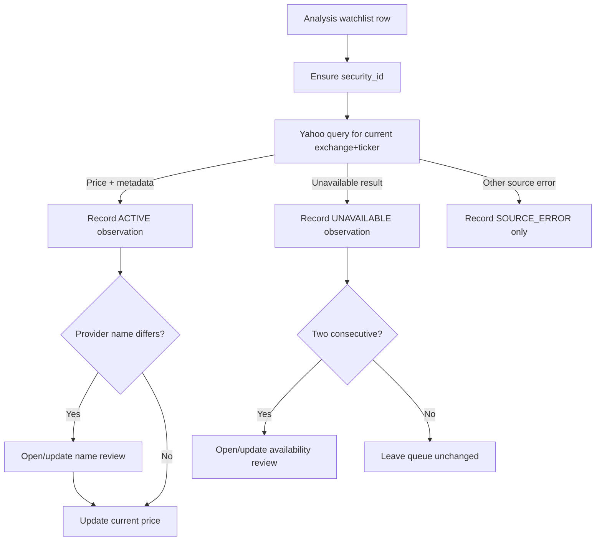

# Watchlist Identity And Listing Verification v1.0

Status: implemented in the current source and UAT workflow. This document is not a certification of the production revision. Source review: 11 September 2026.

## Purpose

Watchlist rows must survive a display-name change, temporary quote outage, or
eventual ticker change without silently becoming a different security. This
contract separates the existing stable `security_id` from an external quote
provider's current observation.

The first version is intentionally conservative. It detects evidence that
needs review; it never makes an identity decision for the user.

## Source Hierarchy

| Question | Authority in v1 | Rule |
| --- | --- | --- |
| What position is actually held? | Latest broker statement | Broker import remains authoritative. |
| What security does an Analysis row represent? | `security_id`, ISIN, then exchange+ticker | Name is an alias, not a provider lookup key. |
| Is the current ticker returning a quote? | Yahoo Finance | Advisory liveness and price observation only. |
| Has a legal name/ticker changed or listing ceased? | Not yet integrated | Requires a corporate-action/reference source or a manual decision. |

Yahoo must never be used to infer a successor ticker by searching the old
company name. A failed or mismatched Yahoo response is evidence, not an
instruction.

## Invariants

1. A new Analysis/watchlist row receives a `security_id` when it is written.
2. Refreshing prices cannot rename a security, change a ticker, set a security
   inactive, change an asset class, or modify TradingView connections.
3. A provider name mismatch opens a review only. It does not modify
   `stock_analysis.name`.
4. A failed quote is called `LISTING_UNAVAILABLE`, not delisted. The review
   opens only after two consecutive classified unavailable observations.
5. Provider/network/rate-limit failures are stored as `SOURCE_ERROR`; they do
   not open an unavailable-listing review.
6. A ticker change remains a separately confirmed operation because every CDF,
   TMS, and Outperform alert may still point to the old TradingView chart.

## Implemented Data Model

Existing identity tables:

- `security_identities`: durable identity, canonical name, exchange+ticker,
  optional ISIN.
- `security_name_aliases`: historical names attached to a stable identity.
- `stock_analysis.security_id`: Analysis/watchlist link.

New advisory tables:

| Table | Role |
| --- | --- |
| `security_listing_checks` | Latest provider observation, requested/observed symbols, health status, and consecutive failure count. |
| `security_listing_reviews` | Deduplicated human review items. Current types are `NAME_CHANGE_CANDIDATE` and `LISTING_UNAVAILABLE`. |

The review dedupe key is the stable identity plus review type, provider, and
observed identity data. Repeated refreshes update `last_seen_at` and
`seen_count`; they do not create a noisy queue.

## Refresh Flow



`POST /api/analysis/refresh-prices` now returns:

```json
{
  "updated": 12,
  "errors": [],
  "open_reviews": 1,
  "new_reviews": 1
}
```

`GET /api/analysis/listing-reviews` returns open review records for the
Analysis UI. The Analysis toolbar shows a compact review control only when
there is something to inspect.

## User Flow In v1

1. Add a watchlist row using its current exchange+ticker and display name.
2. Use `Refresh Prices` as usual.
3. If a provider observation differs, open `Listing reviews` in Analysis.
4. Verify a prospective name or ticker change using a primary source: broker
   statement, exchange announcement, or corporate-action/reference feed.
5. Make the change manually through the dedicated future resolution workflow.
6. Reconnect or confirm every affected TradingView alert before treating a
   ticker migration as complete.

There is deliberately no Accept, Rename, or Dismiss action in v1. A review
surface without a verifiable source must not pretend to resolve identity.

## Planned Migration

### v1.1: Manual resolution workflow

- Add a review decision record with `DISMISSED`, `RESOLVED`, and `SUPERSEDED`.
- Add a guarded name-change action that appends an alias while preserving the
  current stable identity.
- Add a guarded ticker-change action that creates a migration plan rather than
  silently overwriting live alert setup.
- Show the exact CDF, TMS, and Outperform connections that need reconfirmation.

### v2: Authoritative corporate-action ingestion

- Ingest broker corporate-action data and/or a reference-data provider keyed by
  ISIN/vendor identifier.
- Match an old and new ticker only when the corporate action supplies stable
  evidence.
- Produce a review-ready migration proposal with identity, aliases, mappings,
  historical price continuity, and TradingView reconnection checklist.

### v3: Operational monitoring

- Scheduled listing checks with bounded retry/backoff.
- Work-ledger entry for unresolved identity reviews.
- Daily reminder only when a new or persisted review requires attention.

## Tests

Backend coverage in `backend/watchlist_listing_test.go` proves that:

- a different Yahoo name creates one deduplicated review and leaves the
  watchlist name unchanged;
- a valid observation links the row to a stable identity and refreshes price;
- two unavailable observations, not one, create an availability review;
- neither path retires or renames the security.

`tests/uat/listing-reviews-ui.spec.ts` verifies that the Analysis control and
read-only modal present provider evidence without offering a data-changing
action.
