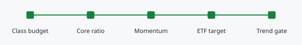

# Core ETFs and momentum

Core ETFs implement part of an approved asset class. Momentum adjusts their emphasis within that class; it does not replace the approved portfolio shape with a separate ETF portfolio.

## Choose Core In Context

Double-click the fund in Positions to open the Security sidebar, or use the ETF sidebar's fund controls. Core selection and removal are separate from ratio selection. A 1:4 ratio allocates one quarter of the class budget to the Core base; 1:2 means half and 1:1 means the whole class. Positions keeps the ratio as a compact read-only chip.

Core is a role, not an instrument type or a TradingView script. A fund must be correctly classified and assigned in Analysis. An unheld Core target can appear in the sidebar without becoming a broker holding.

## Understand The Target

The class budget and Core ratio determine the base. The momentum model then increases or decreases that base within configured limits. The current default influence is 50%: a preference 20% above the model's equal-share reference produces a 10% increase in the Core base. Influence is a setting, not another 50% portfolio allocation.

The fixed legacy model has 15 members. When all 15 weights are available and sum to 100%, their equal-share reference is 6.67%. The calculation uses the available model rows, so missing rows or a different total can change that reference. The reference contributes no cash. A $4,000 approved class budget at 1:4 gives a $1,000 base; a 1.10 multiplier gives a $1,100 recommended target.

The ledger caps the recommended ratio at the whole class and sets its effective target to zero on Sell. This target is not a funded purchase permission: current Q3/Q4, trend, connection, capacity and cash checks still apply before an increase.

Unused ETF capacity can be used by stocks in the same class. ETFs still held continue to occupy capacity even if their target falls to zero. Capacity is not available cash, and a model adjustment is not automatically a worthwhile trade.

## Optional Weight Management

The opt-in Weight management setting beside Ideal wt in Positions
limits Core ETF purchases to the effective target and proposes a reduction
back to that target at 125% coverage. The breach must persist across two fresh
daily observations, and the proposed sale must be at least the greater of A$100
or 0.25% of portfolio value. Coverage visuals alone do not create trade instructions.

The setting defaults Off. Off leaves targets and coverage visible but
remove individual weight ceilings, without removing class capacity, cash,
Q3/Q4 or profile-specific signals. These rules depend on the Core role, not
which TradingView management profile the fund uses. Removing Core status will
not itself request liquidation. See [Positions](positions.md)
for the full agreed policy and the handling of pending executions.

## Read The Coverage Bar

The ETF sidebar starts with a compact ETF allocation summary. The dollar pair shows held value / effective ETF target, with a full-width funding bar underneath. The smaller signed amount is held value minus effective ETF target: red positive is above target; blue negative is below target. This is an allocation difference, not profit or loss. Hover or focus the summary, or tap it on touch screens, for labelled details. The three icons beside the heading switch between Line Fill, Capital Map and Ring Fill. Your selected view is remembered.

Line Fill is a compact allocation list. Each fund shows its ticker and held / target amounts on the first row, then its asset class, available trend and allocation difference below. Its funding bar spans the row underneath. Differences below $250 remain muted for readability; this is not a trade threshold. Click a fund to open its existing Core and ratio controls.

In Line Fill, the marker at 80% of the track represents a fully funded target. Empty space before it is underfunding; red beyond it is overcommitment. The final segment represents up to 25% above target and is bounded; the numbers remain exact even when the bar is full. A known zero target makes all held value excess. An unavailable target leaves the bar unfilled, without a marker or calculated difference; it is not a known target of zero.

Ring Fill uses the earlier bordered fund cards: a funding circle, ticker and fund name, held / target amounts and asset class. The number on the right shows the difference from that fund's effective ETF target. Click the number to switch between percentage and dollars; click elsewhere on the card for the same Core and ratio controls as Line Fill.

The percentage is `(held - target) / target x 100`. For example, $1,250 held against a $1,000 target shows **+25.0%**, or **+$250** after clicking. Red positive means above target, blue negative means below target, and zero is neutral. This is not momentum, investment return or percentage points of your whole portfolio. A missing target shows an unavailable difference. With a zero target and remaining holdings, the dollar difference is available but the percentage is not; click the number to see dollars.

The circle compares held value with the current effective target. At 50% funding it is half blue; at 100% it is fully blue. Above target, a red arc overlays the excess: 125% funding shows a quarter red, and 200% or more shows a full red ring. Exact held/target amounts remain visible. Empty holdings show an unfilled track; a missing target shows a dashed unfilled track. If the target is explicitly zero, any remaining holding is all excess and the ring is red. These displays do not change targets or submit trades.

The optional Capital Map offers another view of allocation footprint. Neither visual is an instruction to buy. Watchlist funds are candidates not currently held; selecting Core does not execute a purchase.

## Management And Ranking

ETF mode uses the dedicated ETF script and its exit behaviour. TMS mode uses the CDF/TMS workflow while retaining the instrument's ETF classification. Changing modes requires an initial direction and compatible connections in Alerts; unresolved execution evidence must be reconciled first.

The Ranking view shows model returns, volatility, score, rank, weights and source dates. Price refresh, recalculation and publication are different events. The latest calculated ranking may not be the published weight currently used for allocation. Adding an ETF to Analysis does not automatically expand the engine's configured universe.

In the full ETF page, Allocation and Momentum switch between class implementation and ranking. Calculation details in Momentum contains the model identifier, run information and source dates. This disclosure changes presentation only; the published allocation weights and ranking calculations are unchanged.
