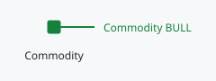
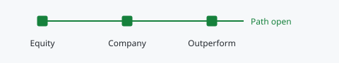

# Market gates

Markets follows commodity-linked evidence through Commodity, Equity, Company and Outperform. These are recorded trend states, not four automatic instructions to purchase.

## Direct commodity sleeve

Commodity is the direct commodity CDF for that market. It governs an approved direct-commodity vehicle and does not open, close or resize producer-equity exposure. If no accessible vehicle exists, positive commodity evidence alone cannot create one to buy.

## Equity, Company, then Outperform

Equity is the producer basket relative to its commodity. Company summarises the existing CDF state of eligible companies in that market. Outperform summarises each eligible company relative to the producer basket. Research, entry, sizing, cash and TMS remain separate controls.

## Signal States

- **Bull:** the recorded closed-bar CDF state is Buy.
- **Bear:** the recorded closed-bar CDF state is Sell.
- **Company count:** Company and Outperform show a count such as 1/4, not one selected company's direction for the entire class.
- **Blank:** no connected feed or usable current state is available. It is not a neutral or bearish observation.

## Configure And Investigate

The next step identifies missing connections. Record those in [Alerts](alerts.md), including the current direction. The accordion shows stock evidence; clicking the market row retains access to its detailed view.

Edit the market at the left edge to update its name and source pair when an exchange symbol changes. Source changes also affect the corresponding Alerts setup; confirm the new source rather than assuming the old connection still applies. The 60-day percentage is price-history evidence with its own source date, separate from the trend signal.
