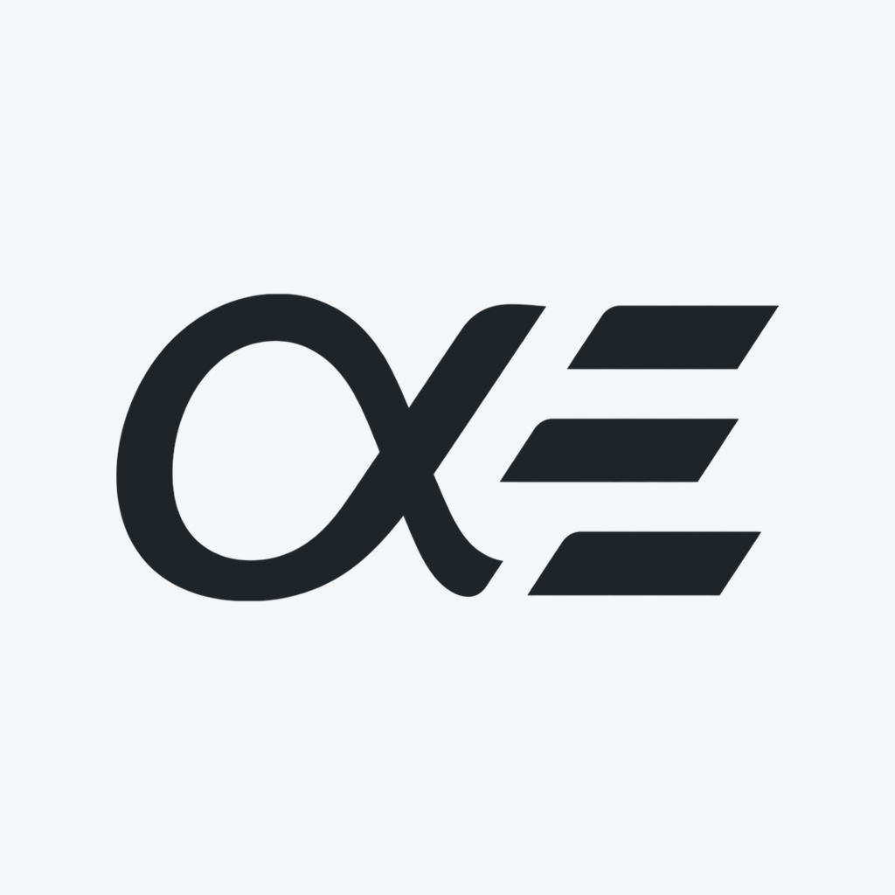
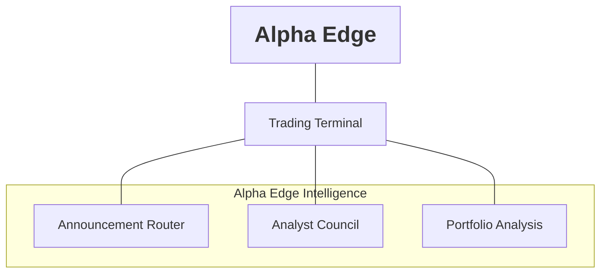

<picture>
  <source media="(prefers-color-scheme: dark)" srcset="public/alpha-edge-icon-dark.png">
  <source media="(prefers-color-scheme: light)" srcset="public/alpha-edge-icon-light.png">
  
</picture>

# Alpha Edge

Alpha Edge brings portfolio construction, security research, announcement-driven
updates and day-to-day portfolio management into one investment application.

The **Trading Terminal** is the workspace. **Alpha Edge Intelligence** brings
together three connected workflows: **Announcement Router**, **Analyst Council**
and **Portfolio Analysis**.



| Alpha Edge Intelligence | Role |
| --- | --- |
| **Announcement Router** | Assesses incoming company announcements against existing research and scenarios. |
| **Analyst Council** | Produces per-security research, model assessments, scores and valuation evidence. |
| **Portfolio Analysis** | Reviews the portfolio as a whole and produces memos to inform its asset-class shape. |

These three workflows live together in the separate **Alpha Edge Intelligence**
application. This repository contains the **Trading Terminal**:
holdings, approved shapes, research views, signals, decisions and broker-statement
reconciliation. Intelligence supplies evidence; the Terminal keeps the portfolio
record and the user makes the decisions.

**Alpha software. Orders are placed by the user at their broker, not by Alpha
Edge.** Research and momentum are evidence, not guarantees or automatic orders.

[Try the public demo](https://alpha-edge-demo-frontend.fly.dev): real ASX company
names, simulated holdings, read-only access and no connection to a private account.

## Who It Is For

Alpha Edge is built for a self-directed investor managing one private portfolio.
It brings research, allocation policy and execution evidence into one place;
the user remains responsible for decisions and broker orders.

Visitors can explore the public demo without signing in or spending AI credits.
Self-hosters can run their own separate installation. There is **no public sign-up,
multi-user account management or tenant-isolated portfolio hosting** in this release.

## Inside The Trading Terminal

- **Positions:** current holdings, class exposure, signals and action responses.
- **Analysis:** live security research, watchlist, scores and advisory sizing.
- **Portfolio:** approved class shapes, actual allocation, historical approvals and saved memos.
- **Markets and System:** commodity/producer gates and the portfolio decision hierarchy.
- **Alerts:** TradingView connections and HotCopper/Seeking Alpha subscription setup, separate from actionable alerts in the left sidebar.
- **History:** statement-derived performance, shape approvals and execution evidence.
- **News and ETFs:** narrative evidence, Core ETF allocation and internal momentum ranking.

The current strategy is class-budget-first. Core ETFs share those budgets with
stocks; Q3/Q4 and trend rules constrain implementation. A recorded execution is
not a broker confirmation and a recorded sale does not immediately create
spendable cash.

## Typical Workflow

1. Construct and approve an asset-class portfolio shape. Compare actual holdings
   with that approved reference and review its history.
2. Research securities in Analysis. Model outputs, momentum and Ideal wt provide
   evidence; optional weight management is a separate, explicit policy choice.
3. Review permitted actions alongside current holdings, available cash, class
   budgets and market/position signals.
4. Place orders at the broker and record what was executed in Alpha Edge.
5. Import the next broker statement to reconcile units and cash. Review exceptions
   before treating recorded execution as confirmed or proceeds as spendable.

The [user guide](DOCS/user/README.md) explains each screen and the
[system guide](DOCS/system/README.md) documents the strategy and its boundaries.

## Architecture

```text
Browser / Next.js Trading Terminal
  |-- Go REST backend --> SQLite holdings, signals, decisions, shapes
  |     |-- TradingView webhooks (durable inbox)
  |     |-- Broker statement imports (IG complete-holdings workflow)
  |     `-- Scheduled market-data / narrative refresh
  `-- Authenticated Next Council proxy
        `-- Alpha Edge Intelligence (separate application)
              Analyst Council / Announcement Router / Portfolio Analysis
```

This repository contains the Next.js frontend, Go backend, integration tooling
and documentation. It does not contain the Alpha Edge Intelligence implementation or
the externally hosted Google Apps Script triggers.

The frontend uses Next.js, React and TypeScript. The Go REST service stores
evidence in SQLite; deployed databases use a dedicated Fly volume and LiteFS.
Alpha Edge Intelligence is a separate integration, not a prerequisite for the
read-only demo or basic local holdings interface.

| Directory | Contents |
| --- | --- |
| `app/`, `components/`, `styles/`, `lib/` | Terminal UI, session gateway and shared client logic |
| `backend/` | Go API, signal/statement workflows and versioned database migrations |
| `DOCS/` | User guides, system rules, REST contracts and operations runbooks |
| `tests/`, `scripts/` | Isolated workflow/browser tests, documentation checks and operator tools |

## Access And Security

| Access | Behaviour |
| --- | --- |
| Public demo | Anonymous, synthetic data, read-only; no private backend or paid AI access |
| Private owner | Passkey login, HttpOnly session cookies, CSRF-protected writes and offline recovery codes |
| Trusted services | Server-side API tokens; TradingView retains its separate webhook secret |
| Legacy browser login | Transitional token entry; not the intended public-facing owner login |

Owner mode is single-user and explicitly configured. Never connect the public demo
to a private database or add provider secrets to it. Never put API tokens in
`NEXT_PUBLIC_*` variables. Enabling sessions does not revoke old machine-token
copies. See [security](SECURITY.md) and the
[owner access runbook](DOCS/operations/OWNER_SESSIONS_AND_DEMO.md) for activation,
recovery and current deployment status.

## Run The Demo

With Node.js 24 LTS installed, from the repository root:

```sh
npm ci
npm run dev:demo
```

Open [the local demo](http://127.0.0.1:3312). No database, API token, AI key or
broker account is needed. It uses fixed examples, not live prices or a personal
portfolio. Presentation controls work; data mutations and paid jobs are blocked
server-side. This is the quickest way to evaluate the application.

## Local Development

The following starts an **empty private development instance** using the
transitional token workflow. It is not the public demo. For passkey development
use [owner setup](DOCS/operations/OWNER_SESSIONS_AND_DEMO.md#private-configuration)
and a `localhost` hostname; do not change a live deployment just to test login.

Prerequisites: Node.js 24 LTS (see `.nvmrc`), npm, Go (module declares
1.26) and a C compiler for `go-sqlite3`. Use an empty development database, not a
production volume or personal broker export. No populated demo account is
provided by these commands.

From the repository root:

```sh
npm ci
```

Use npm and the committed `package-lock.json` for reproducible installs. The
unused Vaul dependency has been removed; no legacy peer-dependency flag is
required. npm is the only supported package manager; do not add competing lockfiles.

Start the backend in one terminal:

```sh
export API_TOKEN="$(openssl rand -hex 32)"
export WEBHOOK_SECRET="$(openssl rand -hex 32)"
export DB_PATH="$PWD/backend/local-development.db"
export PORT=8080
export CORS_ALLOWED_ORIGINS="http://localhost:3100,http://127.0.0.1:3100"
cd backend
go run .
```

Start the frontend from the repository root in another terminal:

```sh
NEXT_PUBLIC_API_URL=http://127.0.0.1:3100/api/trading \
ALPHA_EDGE_DEV_API_PROXY_URL=http://127.0.0.1:8080/api \
npm run dev -- --hostname 127.0.0.1 --port 3100
```

Open [the local terminal](http://127.0.0.1:3100). Use the generated backend
`API_TOKEN` in the app's API connection settings. Token entry authorises requests;
it does not populate holdings or configure Alpha Edge Intelligence. Keep these
credentials local and out of logs, screenshots and Git.

For local provider isolation, scheduler switches can be disabled through
authenticated settings before adding data. Never supply paid-service credentials
to an unattended test environment. See [local operation and configuration](DOCS/operations/README.md).

## Verify

```sh
npm run docs:audit
npm run test:docs
npm run typecheck
npm ls --all
npm audit
npm run build
```

Backend tests run from `backend` with `go test ./...`; database recovery checks
also run with `go test -race ./internal/database ./cmd/dbtool`. See
[testing](DOCS/development/TESTING.md). UAT tests can mutate data: do not point them
at production. Database upgrades require a verified backup; follow the
[upgrade and recovery runbook](DOCS/operations/DATABASE_UPGRADES_AND_RECOVERY.md).

## Documentation

Start at the [documentation map](DOCS/README.md), [user guide](DOCS/user/README.md),
[system guide](DOCS/system/README.md) or [REST and signal contracts](DOCS/api/README.md).
User guides also supply the in-app Help pages. API inventory is source-checked;
full response-schema coverage is still unfinished.

## Limits And Release Discipline

The supported automated broker input is a complete IG statement. External
holdings are legitimate but manually maintained; Yahoo listing observations do
not prove a legal rename or delisting. Data sources can be stale or unavailable.
Intelligence jobs depend on separately configured services and may incur costs.

UAT and production are separate environments. A source change is not a deployed
release. Follow the [operations runbook](DOCS/operations/README.md), preserve
broker evidence and never promote UAT test data into production.

## Licence And Source Releases

Licensed under [Apache 2.0](LICENSE); see [NOTICE](NOTICE) for attribution and
third-party boundaries. This does not grant access to private portfolios,
provider subscriptions or the separate Alpha Edge Intelligence implementation.

Public source releases use a reviewed, history-free snapshot. Private deployment
records and account data are not part of that release. See the
[public source policy](DOCS/development/PUBLIC_SOURCE.md).

See [frontend dependency hardening](DOCS/development/DEPENDENCY_HARDENING_2026-09-12.md)
for the current npm baseline, verified checks and remaining backend/container work.
